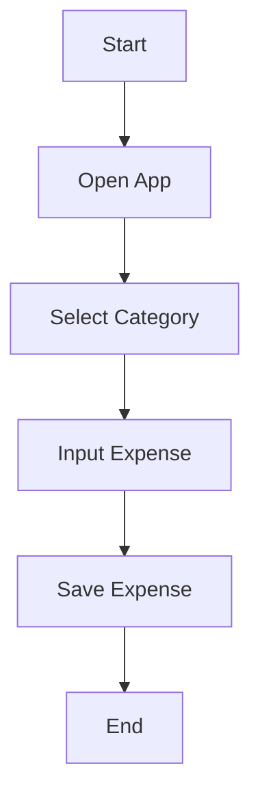
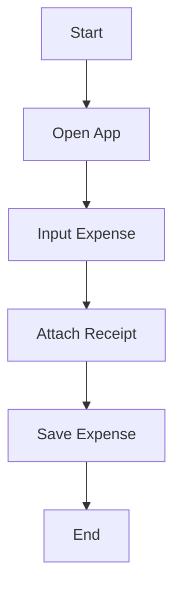
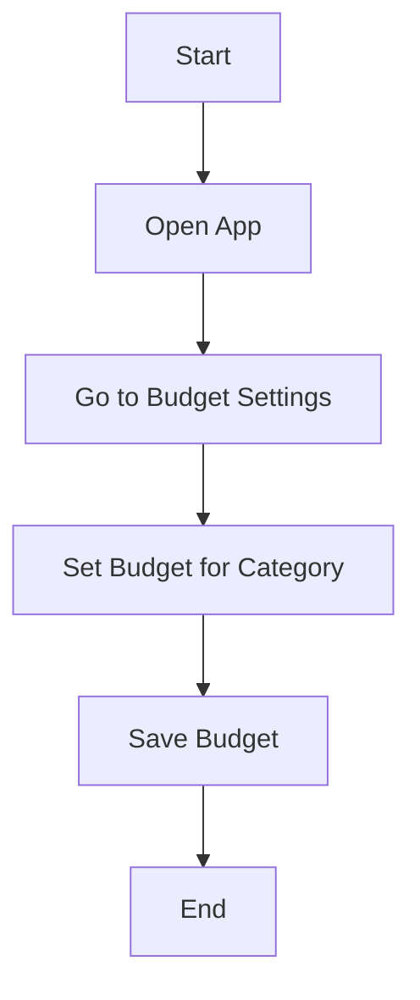
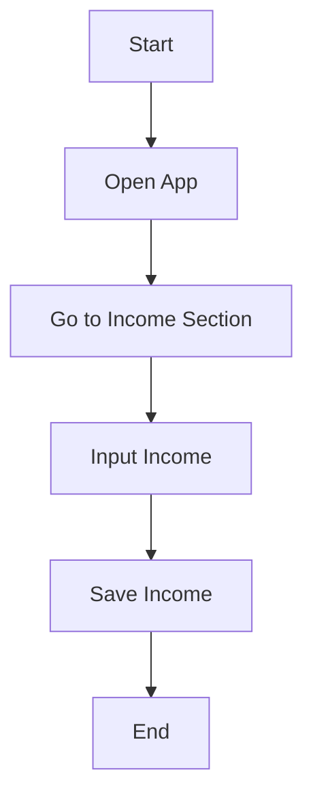
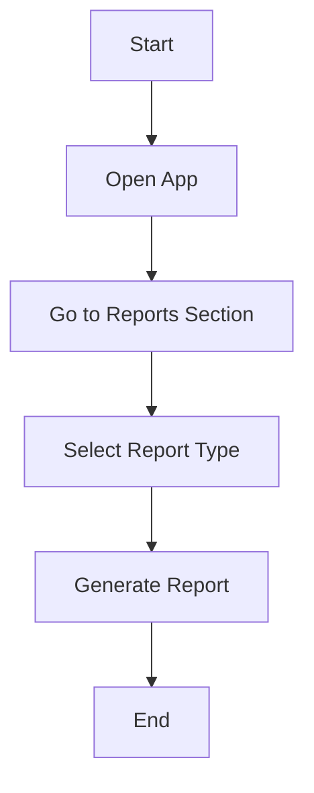
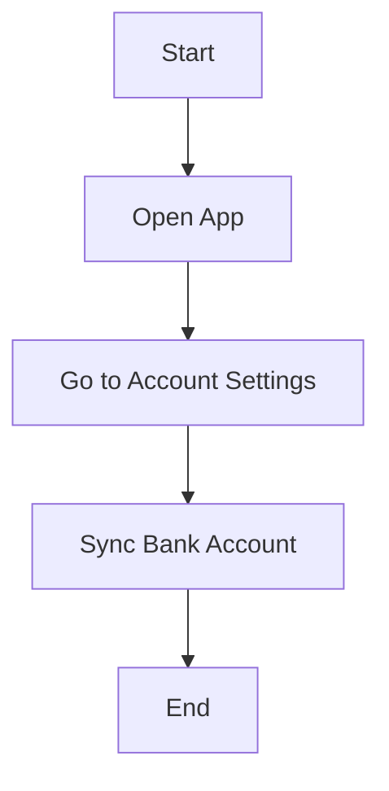
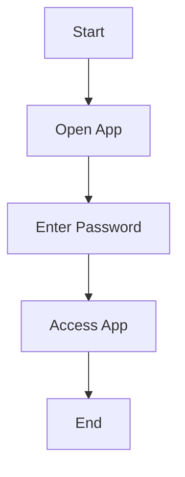

```markdown
# Workflow Diagrams for Personal Expenses Tracking App

## Manual Input of Expenses



## Attaching Receipts



## Setting Budgets



## Recording Income



## Generating Reports



## Syncing with Bank Accounts



## Ensuring Security


```